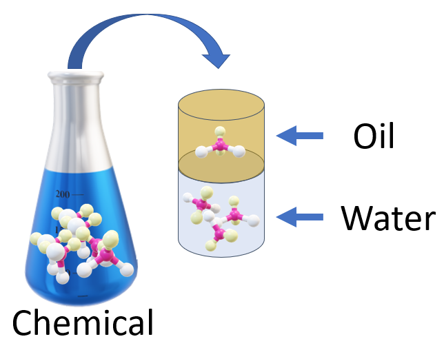
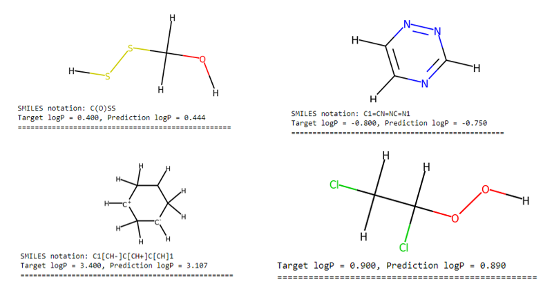
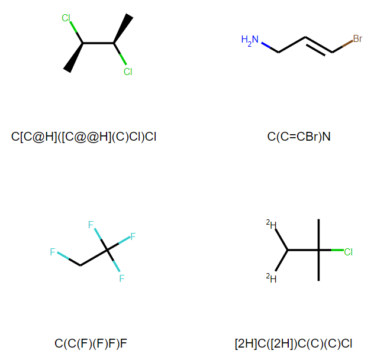

# Chemistry with TensorFlow (and OpenVINO)
## Using TensorFlow to model chemistry problems.
### An example of predicting [lipophilicity](https://www.sciencedirect.com/topics/chemistry/lipophilicity) from the molecular formula ([SMILES](https://en.wikipedia.org/wiki/Simplified_molecular-input_line-entry_system)).

This notebook is based on the excellent [Kaggle tutorial](https://www.kaggle.com/vladislavkisin/tutorial-ml-in-chemistry-research-rdkit-mol2vec) from [Vlad Kisin](https://www.kaggle.com/vladislavkisin). In this example, you'll learn how to read a Chemistry datafile and create predictive models of [lipophilicity](https://en.wikipedia.org/wiki/Partition_coefficient#Partition_coefficient_and_log_P). 



[Lipophilicity](https://en.wikipedia.org/wiki/Lipophilicity)  is the ability of a chemical compound to dissolve in non-polar (fatty or oily) solvents. In simple terms, if you had a glass of oil and water (which will separate with one on top of the other as in the figure above), then lipophilicity is the proportion of how much a chemical dissolves in the water portion versus the oil portion. In the figure there are 3 molecules in water to every 1 molecule in oil. P is 3 and the log P is $`\log_{10}{3} = 0.477`$.

Lipophilicity contributes to the [absorption, distribution, metabolism, excretion, and toxicity](https://www.sciencedirect.com/topics/chemistry/lipophilicity) of a pharmaceutical and contributes to a drug's potency and selectivity.



I'll demonstrate how to load the raw data from a CSV file and use the [RD-Kit](https://github.com/rdkit/rdkit) and [Mol2Vec](https://pubs.acs.org/doi/10.1021/acs.jcim.7b00616) packages to create features based on the chemical formula of a molecule.



### Installation

I tested this on Ubuntu 18.04 and the Anaconda Python Distribution. To setup the conda environment (which I labeled `chem`):

```
conda create -n chem python=3.8 pip jupyter matplotlib seaborn
conda activate chem
conda install -c conda-forge rdkit
pip install git+https://github.com/samoturk/mol2vec
wget https://raw.githubusercontent.com/tonyreina/mol2vec/master/mol2vec/features.py -O  ~/anaconda3/envs/chem/lib/python3.8/site-packages/mol2vec/features.py
wget https://github.com/samoturk/mol2vec_notebooks/blob/master/Notebooks/model_300dim.pkl
pip install -U tensorflow==2.4.1
pip install openvino-tensorflow==0.5.0
conda install scikit-learn
pip install py3Dmol
```

### Run
Run the jupyter notebook [chemistry_predict_logP_tensorflow.ipynb](chemistry_predict_logP_tensorflow.ipynb)
